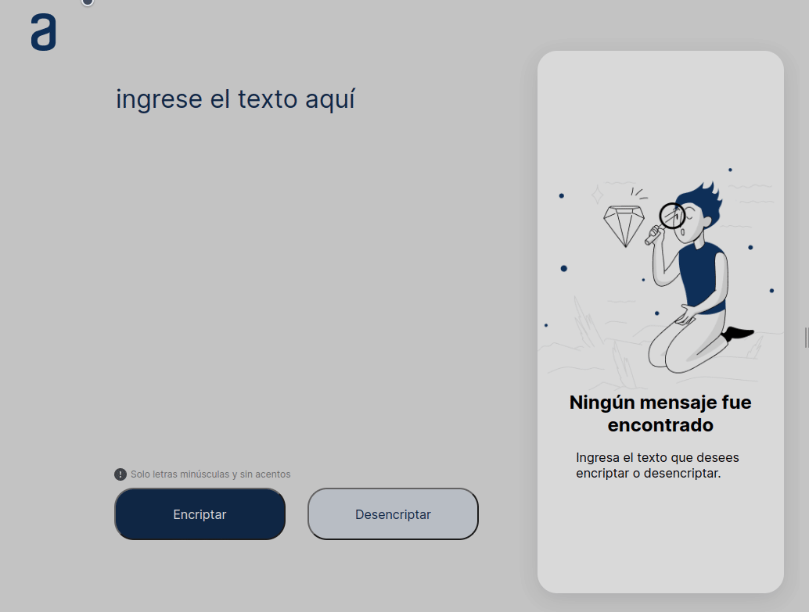

# Challenge ONE

## Descripción

> Challenge ONE Sprint 01: Construye un encriptador de texto con JavaScript

## Tabla de Contenidos

- [Challenge ONE](#challenge-one)
  - [Descripción](#descripción)
  - [Tabla de Contenidos](#tabla-de-contenidos)
  - [Instalación](#instalación)
  - [Uso](#uso)
  - [Contáctame](#contáctame)
  - [Pruebas](#pruebas)
  - [Licencia](#licencia)
  - [Contribuciones](#contribuciones)
  - [Agradecimientos](#agradecimientos)

## Instalación

Para instalar las dependencias necesarias, ejecuta el siguiente comando:

`pnpm install` o `npm install`

## Uso

Para probar la aplicación da clic [aquí](https://fabgrel10.github.io/fabgrel10-challenge-one-oracle-next/) o ejecuta un servidor localmente desde tu terminal con pnpm http-server

## Contáctame

| &nbsp;       | &nbsp;                                               |
| ------------ | ---------------------------------------------------- |
| **GitHub**   | [@fabgrel10](https://github.com/fabgrel10)           |
| **Twitter**  | [@fabgrel10](https://twitter.com/fabgrel10)          |
| **LinkedIn** | [@fabgrel10](https://www.linkedin.com/in/fabgrel10/) |

## Pruebas

Aún no se han implementado pruebas para este proyecto.

## Licencia

Este proyecto está licenciado bajo la [unilicencia](https://unlicense.org), puedes usarlo sin restricciones.

## Contribuciones

Se aceptan contribuciones a este proyecto. Por favor, contáctame para obtener más información.

## Agradecimientos

- ONE – Oracle Next Education
- [Allura](https://www.aluracursos.com/)

¡Deja una ⭐️ si te gusta este proyecto!
